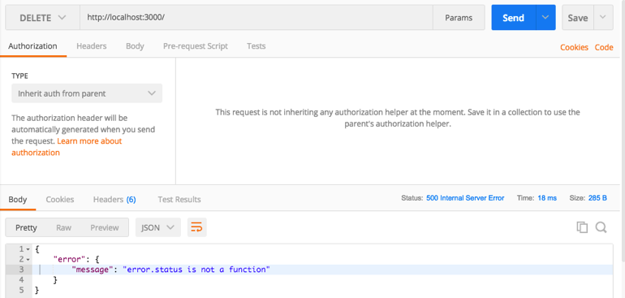

### handle error when invalid route requested
```
// Handle error caused by routes other than 'products' and 'order' routes
app.use((req, res, next) =>{
    const error = new Error('Note Found');
    error.status(404);
    next(error);
});
```

this error is because `error.status(404);` is not a function. Should be
error.status=404;
```
// Handle any error occure in the application other than route
// this error might be dueto database or any problem in the aplication
app.use((error, req, res, next) => {
    res.status(error.status || 500);
    res.json({
        error: {
            message: error.message
        }
    });
});
```