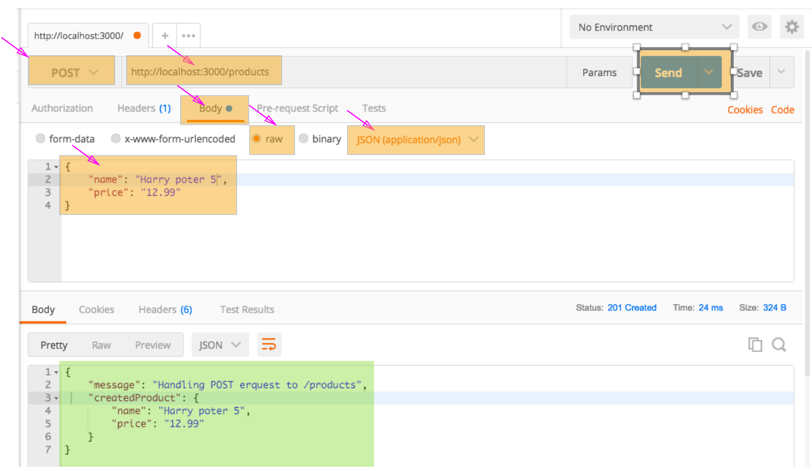
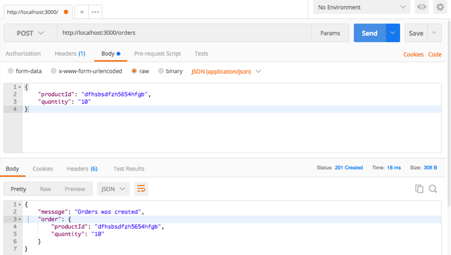

### How to extract request body parameters
```
npm install body-parser

const bodyParsor = require('body-parser');

// parse urlencoded bodies 
app.use(bodyParsor.urlencoded({extended: false}));
// parse json
app.use(bodyParsor.json());
```
Use body parsor to extract product json
```
router.post('/', (req, res, next) => {
    const product = {
        name: req.body.name,
        price: req.body.price
    };
  res.status(201).json({
    message: 'Handling POST erquest to /products',
    createdProduct: product
  });
});
```
for order
```
router.post('/', (req, res, next) => {
    const order = {
        productId: req.body.productId,
        quantity: req.body.quantity
    };
    res.status(201).json({
        message: 'Orders was created',
        order: order
    });
});
```


